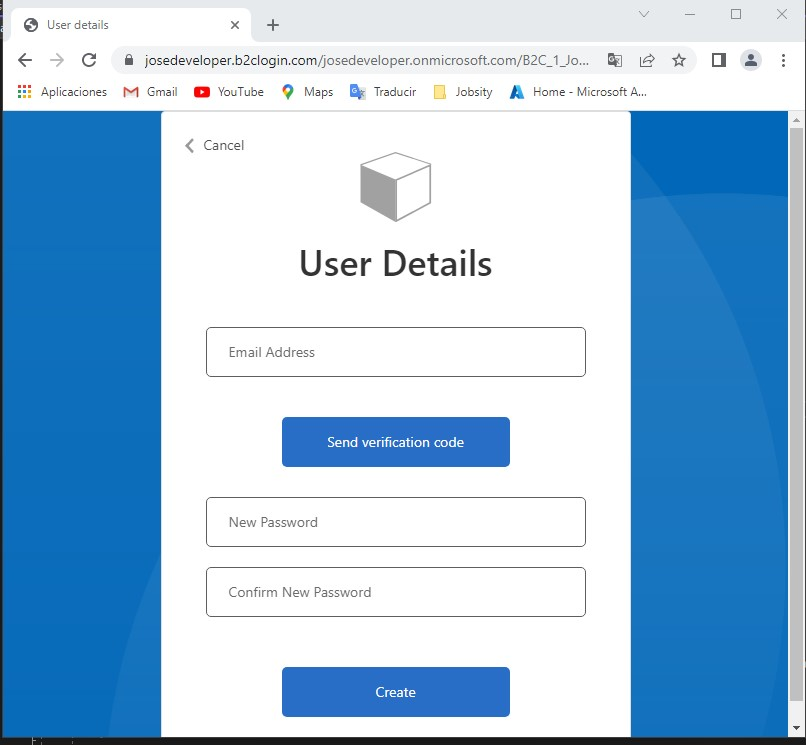
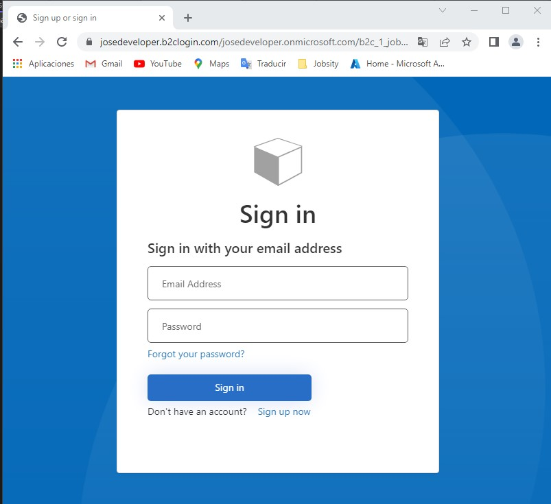
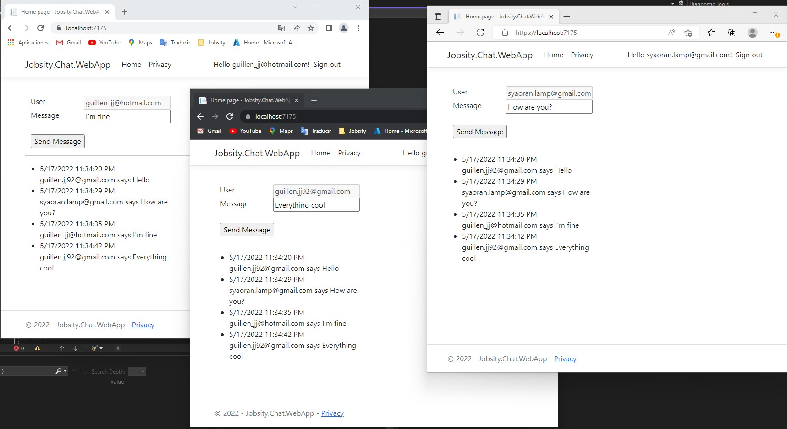
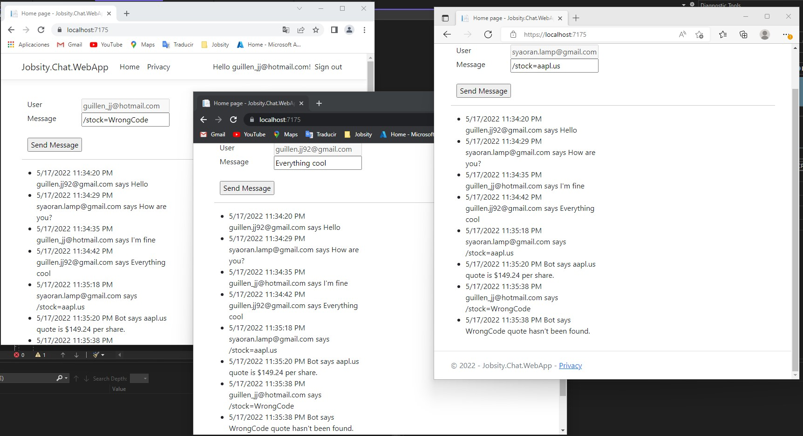

# Jobsity Chat

This is the solution for the challenge "Simplee browser-based chat application".

## About the problem

The problem was particularly difficult since it involved a lot of components and I had only 3 days to complete it, since I had an emergency this friday and saturday. However the main goal was achieved :) 

I actually enjoyed a lot developing this, but I do realize that there's a lot things that can be improved on my code 

Some of the things we definetly could improve are:

1.- Changing a lot of hard coded configuration into the appsettings.jso

2.- Chage the implemetation of a couple of components to use the best practices for each one, I didn't have that much time to implement them

3.- 100% to include a docker compose file, I had the plan since the beggining but because of the time I wansn't able to complete it

## Solution
The solution I proposed was to split the whole project into 3 components 

1.- The web client with the authentication 

2.- An api where we can manage the chat synchronization and all the backend functionalities

3.- The decoupuled bot which it's only assignment is to retrieve the stock information and send it back to the api

I used 7 technologies to complete the challenge:

1.- Web app for the client

2.- Web api for the api XD

3.- Console application for the bot

4.- Azure AD B2C as the authentication technology, the application is using my client credentials since create a new B2C aplication could be really messy, I'll delete the resources after you review it :)

5.- SignalR to syncronize the chat, the syncronization is happening on the API, and the web client is only subscribed to the signalR hub. Although I had the idea on how to implement multiple chat rooms (using groups on signalR) I didn't have the time to do it.

6.- RabbitMQ to create the communication between the api and the bot, the communication is bi-directional with RabbitMQ 

6.5.- In order to make possible that the API is able to subscribe to one RabbitMQ I implemented an independent IHostedService for the subscriber

7.- To save the messages I used entity framework on memory DB, this was the fastest approach I thought, in order to have all the functinalities requested 

## Bonus

I did achieved 2 bonus points

1.- Used .Net Identity for users authentication

2.- Handle error messages generated by the bot, in the images below, you can see part of the messages


## Before you run it

The only 2 things we need to run the solutions are:

1.- Visual studio 2022 or .net 6 installed on your machine

2.- Docker

## Run it

I tried to make it as simple as I could for you guys, the steps to run the project are:

1.-Execute the command below 
```bash
docker run -d --hostname my-rabbitmq-server --name rabbitmq -p 5672:5672 -p 15672:15672 rabbitmq:3-management
```

2.- Clone the repository and run the Bot->APi->WebClient on that order

## Usage

After you have everything running you just need to go to the url below sign-up and sign-in in to the application

```bash
https://localhost:7175/
```

Type any message you want or use the command format to activate the bot

## Application running

Sign-up


Sign-in


Normal message


Bot Message



## I Hope everything goes well

But if not or if you have any question please don't hesitate on contacting me 